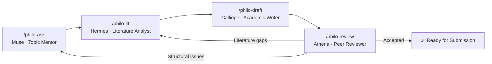

# Philosophy Research Agents

[繁體中文](README.zh-TW.md) | **English**


An AI-assisted academic research system for philosophy and humanities, designed as a complete paper-writing pipeline. It consists of three core components: **Skills**, **Commands**, and **References**.

---

## 🔧 Four Skills — AI Role Playbooks

Each skill defines the AI's **role**, **protocol**, **failure modes to avoid**, and a **quality checklist** for a specific stage of the research process.

### 1. `research-design` — 🎭 Muse (Topic Mentor)

| Item | Description |
|------|-------------|
| **What it does** | Transforms a vague interest into an answerable, significant research question |
| **Role** | Socratic mentor who guides through **questioning**, not lecturing |
| **Process** | Understand background → Find tension/gap → Narrow scope → Select methodology → Produce research proposal outline |
| **Key rules** | Ask only **one question** at a time; distinguish "topic" from "question"; match method to question |

### 2. `literature-review` — 🎭 Hermes (Literature Analyst)

| Item | Description |
|------|-------------|
| **What it does** | Maps the scholarly landscape, identifies research gaps, and positions the user's contribution |
| **Role** | Literature synthesis expert — organizes **thematically**, never source-by-source |
| **Process** | Identify 3–5 literature axes → Suggest search strategies → Thematic synthesis → Critical evaluation → Produce literature map |
| **Key rules** | ⚠️ **Hallucination warning**: All bibliographic details must be flagged for user verification; include both supporting and challenging sources |

### 3. `draft` — 🎭 Calliope (Academic Writer)

| Item | Description |
|------|-------------|
| **What it does** | Writes academic prose with rigorous argument structure |
| **Role** | Academic writing expert — **skeleton first, prose second** |
| **Process** | Select paper structure template → Build argument skeleton → Write section by section (brainstorm → curate → draft → refine) → Save to file |
| **Three templates** | Analytic philosophy (thesis + objections), Continental philosophy (hermeneutic entry), Comparative philosophy (tradition A vs B) |
| **Key rules** | State the problem and thesis upfront — no "throat-clearing"; one claim per paragraph; weave citations into the argument |

### 4. `peer-review` — 🎭 Athena (Reviewer) + Calliope (Writer) — Dual-Role Loop

| Item | Description |
|------|-------------|
| **What it does** | Simulates rigorous peer review, then guides systematic revision |
| **Two-phase loop** | **Phase 1 (Athena)**: Act as Reviewer 2, produce a structured review report → **Phase 2 (Calliope loop)**: Triage feedback → Revise systematically → Re-review → Repeat until "Accept" |
| **Key rules** | Must follow the **Principle of Charity** — attack the strongest version of the argument; never critique without suggesting improvements |

---

## ⚡ Four Commands — User Shortcuts

Commands are **lightweight wrappers** around Skills, enabling users to quickly launch specific workflows via `/philo-xxx`. Each command includes a clear handoff to the next step:

```
/philo-ask → /philo-lit → /philo-draft → /philo-review
  Topic       Literature     Writing        Review
  Design      Review         & Drafting     & Revision
```

| Command | Corresponding Skill | One-line Description |
|---------|--------------------|--------------------|
| `/philo-ask` | `research-design` | Turn a vague idea into a research question |
| `/philo-lit` | `literature-review` | Map the literature landscape for a research question |
| `/philo-draft` | `draft` | Write a paper section by section |
| `/philo-review` | `peer-review` | Simulate peer review + systematic revision |

---

## 📚 Five References — AI Knowledge Base

Skills read these reference files on demand during their work:

| File | Contents |
|------|----------|
| `research-pipeline.md` | Complete research pipeline guide: question formulation → literature review → writing → peer review → revision, with concrete templates and checklists at each stage |
| `philosophical-methods.md` | Detailed guides for six philosophical methods: conceptual analysis, hermeneutics, phenomenology, dialectics, critical theory, analytic methods, and comparative philosophy |
| `writing-standards.md` | Academic writing standards: three paper structure templates + scholarly prose style guide + Chinese/English writing conventions |
| `citation-guide.md` | Citation format guide: APA/Chicago/MLA + philosophy-specific conventions (Plato, Aristotle, Kant, etc. + Chinese classics) |
| `examples.md` | Worked examples (Cases 1–5, demonstrating real conversation flows for each skill) |

---

## 🔄 How It All Works Together



### Core Design Principles

1. **Pipeline architecture**: Each skill is one stage in the pipeline; the last line of every skill suggests which skill to use next
2. **Role separation**: Different stages are handled by different "personas," preventing the AI from conflating tasks within a single conversation
3. **Iterative revision**: `peer-review` can loop back to any earlier stage, forming a revision cycle
4. **On-demand reference loading**: Each skill explicitly declares which reference files to read and when, rather than loading everything at once
5. **Language adaptivity**: All skills follow the rule "respond in the user's language" — Chinese or English
