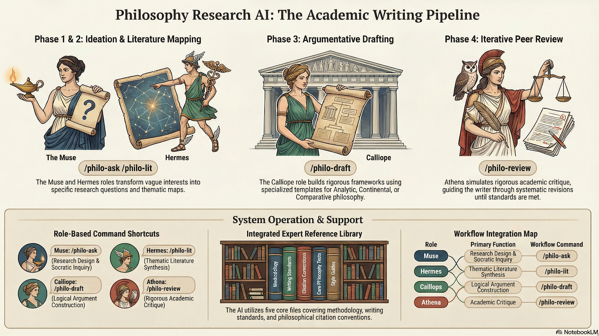
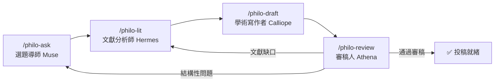

# Philosophy Research Agents

**繁體中文** | [English](README.md)



哲學／人文學科學術研究的 AI 輔助系統，設計為一條完整的論文撰寫流水線（pipeline）。由三個核心部分組成：**Skills（技能）**、**Commands（指令）** 和 **References（參考資料）**。

---

## 🔧 四個 Skills（技能）— AI 的「角色扮演指南」

每個 skill 定義了 AI 在特定階段應該扮演的**角色**、遵循的**協議（Protocol）**、避免的**失敗模式**，以及最終的**品質檢查清單**。

### 1. `research-design` — 🎭 Muse 選題導師

| 項目 | 說明 |
|------|------|
| **做什麼** | 把模糊的興趣轉化為可回答的、有意義的研究問題 |
| **角色** | 蘇格拉底式導師，透過**提問引導**，而非直接給答案 |
| **流程** | 了解背景 → 發現問題（tension/gap）→ 縮小範圍 → 選擇方法論 → 產出研究提案大綱 |
| **關鍵規則** | 每次只問**一個問題**；區分「題目」vs「問題」；方法要匹配問題 |

### 2. `literature-review` — 🎭 Hermes 文獻分析師

| 項目 | 說明 |
|------|------|
| **做什麼** | 繪製學術地圖、找出研究缺口、定位使用者的貢獻 |
| **角色** | 文獻綜述專家，**按主題綜合**，絕不逐篇摘要 |
| **流程** | 辨識 3-5 個文獻軸線 → 建議搜尋策略 → 主題式綜合 → 批判性評估 → 產出文獻地圖 |
| **關鍵規則** | ⚠️ **幻覺警告**：所有書目細節都必須提醒使用者自行驗證；同時納入支持和反對的文獻 |

### 3. `draft` — 🎭 Calliope 學術寫作者

| 項目 | 說明 |
|------|------|
| **做什麼** | 撰寫具備嚴謹論證結構的學術文章 |
| **角色** | 學術寫作專家，**先骨架、再寫作** |
| **流程** | 選擇論文結構模板 → 建立論證骨架 → 逐節寫作（brainstorm → curate → draft → refine）→ 存檔 |
| **三種模板** | 分析哲學（thesis + objections）、歐陸哲學（hermeneutic entry）、比較哲學（tradition A vs B）|
| **關鍵規則** | 開頭直接陳述問題與論點，不要「throat-clearing」；每段一個主張；引用要融入論證 |

### 4. `peer-review` — 🎭 Athena 審稿人 + Calliope 寫作者（雙角色交替）

| 項目 | 說明 |
|------|------|
| **做什麼** | 模擬嚴格的學術同儕審查，然後引導系統性修訂 |
| **兩階段循環** | **Phase 1（Athena）**：扮演 Reviewer 2，產出結構化審稿報告 → **Phase 2（Calliope loop）**：分類回饋 → 逐一修訂 → 再次審查 → 直到達到「可接受」 |
| **關鍵規則** | 必須遵守**慈善原則（Principle of Charity）**，攻擊論證的最強版本；不能只批評不給建議 |

---

## ⚡ 四個 Commands（指令）— 使用者的「快捷鍵」

Commands 是對 Skills 的**輕量包裝**，讓使用者能用 `/philo-xxx` 的形式快速啟動特定工作流。每個 command 都有明確的 handoff（交接），引導到下一個步驟：

```
/philo-ask → /philo-lit → /philo-draft → /philo-review
   選題          文獻回顧       撰寫           審稿
```

| Command | 對應 Skill | 一句話說明 |
|---------|-----------|----------|
| `/philo-ask` | `research-design` | 把模糊想法變成研究問題 |
| `/philo-lit` | `literature-review` | 為研究問題繪製文獻地圖 |
| `/philo-draft` | `draft` | 逐節撰寫論文 |
| `/philo-review` | `peer-review` | 模擬審稿 + 系統修訂 |

---

## 📚 五份 References（參考資料）— AI 的「知識庫」

Skills 在工作時會按需讀取這些參考文件：

| 檔案 | 內容 |
|------|------|
| `research-pipeline.md` | 完整研究流水線指南：從問題制定 → 文獻回顧 → 寫作 → 審稿 → 修訂，每階段都有具體的模板和清單 |
| `philosophical-methods.md` | 六種哲學方法的詳細指南：概念分析、詮釋學、現象學、辯證法、批判理論、分析方法、比較哲學 |
| `writing-standards.md` | 學術寫作標準：三種論文結構模板 + 學術散文風格指南 + 中英文寫作差異 |
| `citation-guide.md` | 引用格式指南：APA/Chicago/MLA + 哲學經典引用慣例（柏拉圖、亞里士多德、康德等 + 中國經典） |
| `examples.md` | 實際案例示範（案例一～五，展示各 skill 的完整對話流程） |

---

## 🔄 整體運作方式



### 核心設計理念

1. **Pipeline 架構**：每個 skill 是流水線的一個階段，最後一行都會建議下一步用哪個 skill
2. **角色分離**：不同階段由不同「角色」負責，避免 AI 在單一對話中混淆任務
3. **循環修訂**：`peer-review` 可以回到前面的任何階段，形成迭代循環
4. **參考資料按需載入**：每個 skill 明確標示了「什麼時候讀哪份參考文件」，而非一次全部載入
5. **語言自適應**：所有 skill 都遵循「使用者用中文就回中文，用英文就回英文」的規則
